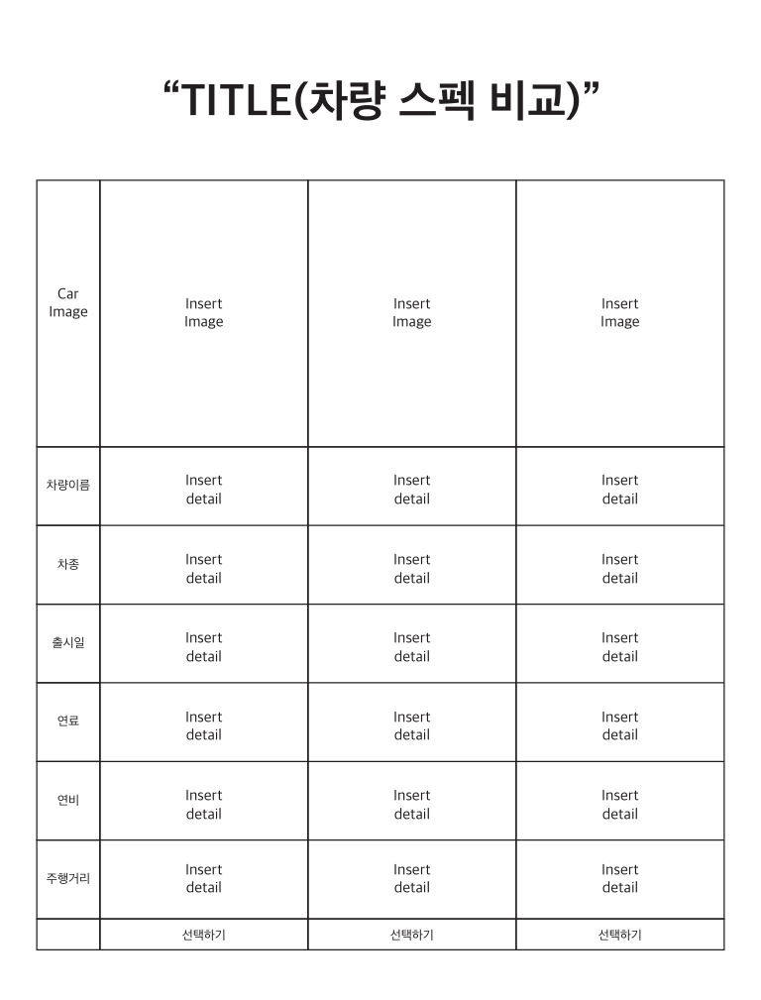
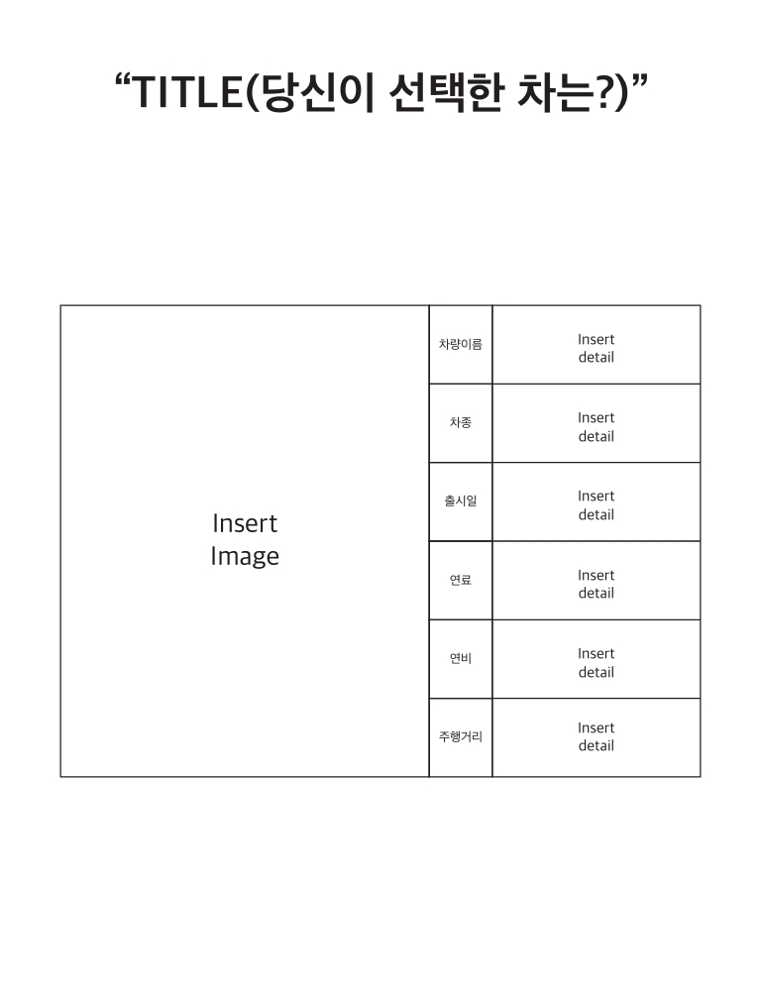
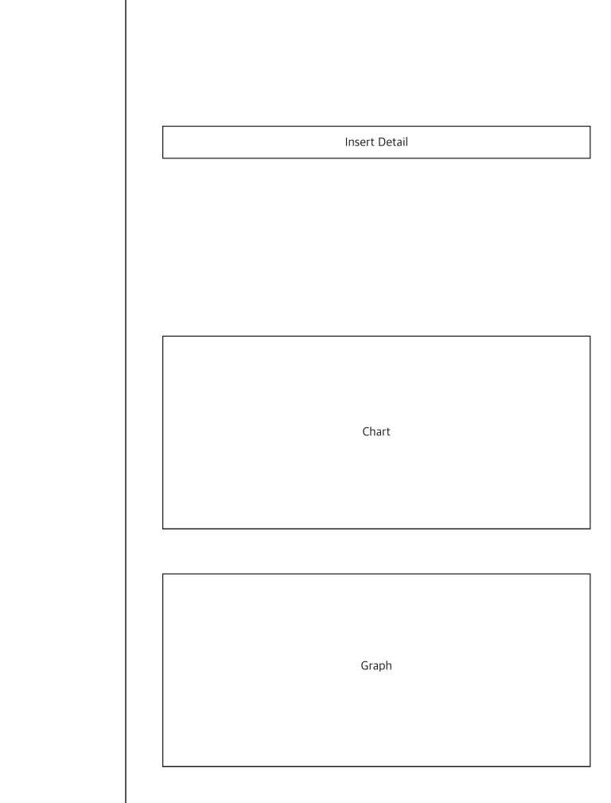
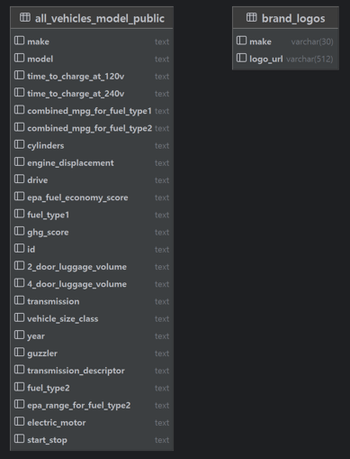
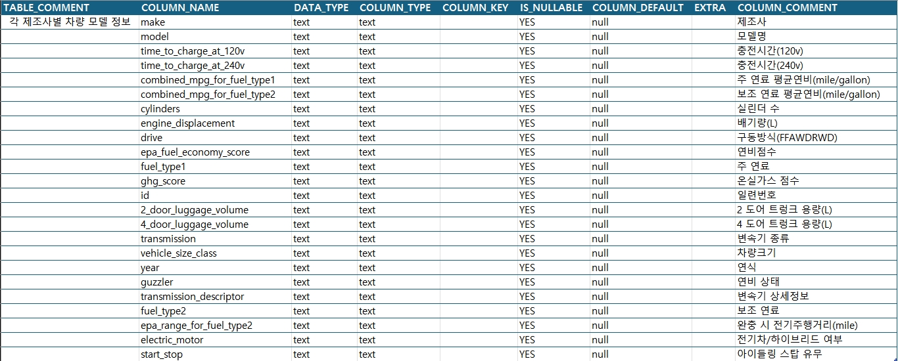
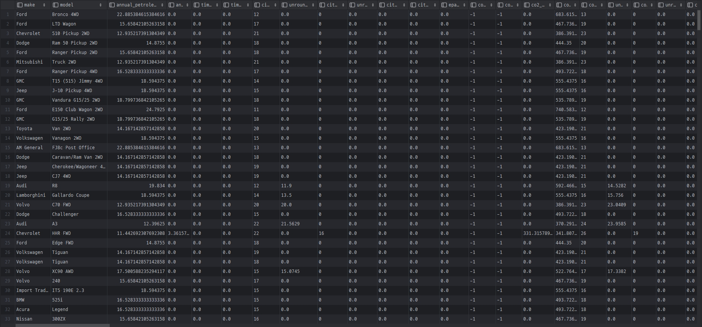
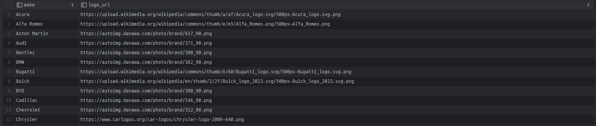
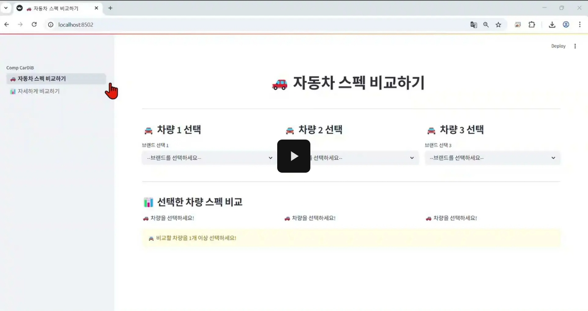

# SKN14-1st-1Team( JJNJJ )

------------------------------------------------------------------------------
# 📚 주요 목차

> [1️⃣ 🚀 프로젝트명 및 개요](#🚀-프로젝트명-및-개요) 
> [2️⃣ 👥 팀 소개](#👥-팀-소개) 
> [3️⃣ 🎮 기술 스택](#🛠-기술-스택) 
> [4️⃣ 📚 ERD (Entity Relationship Diagram)](#📊-ERD-(Entity-Relationship-Diagram)) 
> [5️⃣ 🛠  테이블 명세](#📋-테이블-명세) 
> [6️⃣ 📊 수집 데이터 설명](#📚-수집-데이터-설명) 
> [7️⃣ 📋 시연 동영상](#🎮-시연-동영상) 
> [9️⃣ 💭 한줄 회고](#-💭-한줄-회고)

------------------------------------------------------------------------------
# 🚀 프로젝트명 및 개요

## Comp CarDiB ( 가제 )
- 각 자동차 모델들의 스펙을 한 눈에 비교할 수 있는 서비스 제공. 

## 프로젝트 개요
<table>
  <tbody>
    <tr>
      <th align="center"><strong>프로젝트명</strong></th>
      <td>Comp CarDiB ( 가제 )</td>
    </tr>
    <tr>
      <th align="center"><strong>설명</strong></th>
      <td>각 자동차 모델들의 스펙을 한 눈에 비교할 수 있는 서비스 제공. </td>
    </tr>
      <th align="center"><strong>주요 기능</strong></th>
      <td>
        <ul>
          <li>스펙을 비교할 자동차 조회 및 선택</li>
          <li>선택한 차종간 스펙 비교</li>
          <li>각 제조사 스펙별 차종간 비교</li>
          <li>내가 선택한 차종의 정보를 파일로 다운로드</li>
        </ul>
      </td>
    </tr>
  </tbody>
</table>

------------------------------------------------------------------------------
# 👥 팀 소개

## 팀명 : **JJNJJ**  
> 재아(**J**ae-a), 재우(**J**ae-woo), 빛나(vit**N**a), 지훈(**J**ihun), 성재(sung**J**ae)

## 팀원 소개
<table align="center">
  <thead>
    <td align="center"><a href='https://github.com/sanjum-kim'>김재아</a></td>
    <td align="center"><a href='https://github.com/daronus'>김재우</a></td>
    <td align="center"><a href='https://github.com/ParkVitna'>박빛나</a></td>
    <td align="center"><a href='https://github.com/teolex'>송지훈</a></td>
    <td align="center"><a href='https://github.com/sungjaecho98'>조성재</a></td>
  </thead>
  <tbody>
    <td style="padding:0;"></td>
    <td style="padding:0;"></td>
    <td style="padding:0;"></td>
    <td style="padding:0;"></td>
    <td style="padding:0;"></td>
  </tbody>
</table>

------------------------------------------------------------------------------
# 🛠 기술 스택
<table>
  <thead>
    <tr>
      <th width="250" align="center">구분</th><th width="250" align="center">아이콘</th><th width="400" align="center">링크</th>
    </tr>
  </thead>
  <tbody>
    <tr><th width="20%">개발언어</th><td align="center"></td><td width="60%"><a href="https://www.python.org/">Python</a></td></tr>
    <tr><th width="20%">UI 구성</th><td align="center"></td><td width="60%"><a href="https://streamlit.io/">Streamlit</a></td></tr>
    <tr><th width="20%">Database</th><td align="center"></td><td width="60%"><a href="https://www.mysql.com/">MySQL</a></td></tr>
    <tr><th width="20%">형상관리</th><td align="center"></td><td width="60%"><a href="https://git-scm.com/">Git (with Github)</a></td></tr>
    <tr><th width="20%" rowspan="3">IDE</th>
        <td width="20%" align="center"></td><td width="60%"><a href="https://www.jetbrains.com/ko-kr/pycharm/download/?section=windows">PyCharm</a></td></tr>
    <tr><td width="20%" align="center"></td><td width="60%"><a href="https://www.sourcetreeapp.com/">SourceTree</a></td></tr>
    <tr><td width="20%" align="center"></td><td width="60%"><a href="https://www.adobe.com/kr/products/illustrator.html?gclid=CjwKCAjwq7fABhB2EiwAwk-YbLJrw7-mRCRYIqnGdVLuGMgxUq9CbKeIMayBod6M25lwT6HWHuwmqhoCA9wQAvD_BwE&sdid=QQ42P3HM&mv=search&mv2=paidsearch&ef_id=CjwKCAjwq7fABhB2EiwAwk-YbLJrw7-mRCRYIqnGdVLuGMgxUq9CbKeIMayBod6M25lwT6HWHuwmqhoCA9wQAvD_BwE:G:s&s_kwcid=AL!3085!3!460585117331!e!!g!!adobe%20ai!95734519!4169949319&gad_source=1&gbraid=0AAAAADraYsJzNSsuJazP4vYVVbNUnCQ4M">Adobe Ai</a></td></tr>
  </tbody>
</table>

------------------------------------------------------------------------------
# 🌆 UI설계 (Adobe Ai)
<table>
  <thead>
    <tr>
      <th align="center">차종 비교</th><th align="center">선택한 차량정보</th><th align="center">스펙별 비교 및 차트</th>
    </tr>
  </thead>
  <tbody>
    <tr>
      <td></td>
      <td></td>
      <td></td>
    </tr>
  </tbody>
</table>

# 📊 ERD (Entity Relationship Diagram)

------------------------------------------------------------------------------
# 📋 테이블 명세
<table>
  <thead>
    <tr><th>all_vehicles_model_public 테이블</th></tr>
  </thead>
  <tbody>
    <tr><td></td></tr>
  </tbody>
</table>

<table>
  <thead>
    <tr><th>brand_logos 테이블</th></tr>
  </thead>
  <tbody>
    <tr><td></td></tr>
  </tbody>
</table>

------------------------------------------------------------------------------
# 📚 수집 데이터 설명

본 프로젝트에서 사용한 데이터 및 참고 자료는 다음과 같습니다:
### **차량 스펙**

<table>
  <tbody>
    <tr><th width="120">출처</th><td><a href="https://public.opendatasoft.com/explore/dataset/all-vehicles-model/api/">opendatasoft</a></td></tr>
    <tr><th width="120">수집 목적</th><td>자동자의 연비/용량/연식 등 스펙을 비교하여 보여주며, 차량 선택 시 편의성을 제공하기 위한 데이터가 필요했습니다.</td></tr>
    <tr><th width="120">수집 방법</th><td>단일 차종이 아닌, 각 제조사별 모든 차종에 대한 데이터가 필요했습니다. 국내 통계 사이트의 자료들은 유료거나 차량의 행정정보만 제공하는 등 데이터 수집이 어려웠고, 해외사이트에서 저희가 원하던 형식의 자료를 찾을 수 있었습니다.</td></tr>
  </tbody>
</table>

### 제조사 로고이미지

<table>
  <tbody>
    <tr><th width="120">출처</th><td>스크래핑</td></tr>
    <tr><th width="120">수집 목적</th><td>단순 텍스트만 있는 사이트보다는 좀 더 직관적으로 알 수 있도록 이미지를 추가하고 싶었습니다.</td></tr>
    <tr><th width="120">수집 방법</th><td>기존 API와 최대한 연결이 되는 로고 이미지들의 모임을 찾았습니다. 다만 팝업창에 있는 이미지들이여서 전에 배운 Selenium을 이용하여 순차적으로 스크래핑하였습니다.</td></tr>
  </tbody>
</table>

------------------------------------------------------------------------------
#  🎮 시연 동영상

------------------------------------------------------------------------------
# 💭 한줄 회고
<table>
  <tbody>
    <tr><th width="100"><strong>김재아</strong></th><td>처음이라 어떻게 해야하는지 많이 헤맸지만 주위의 도움으로 잘 해냈습니다. 계속 붙잡고 있으면 어떻게든 해결할 수 있다..!</td></tr>
    <tr><th width="100"><strong>김재우</strong></th><td>시간이 너무 빨리 가네요 정신 없습니다 ㅎㅎ..</td></tr>
    <tr><th width="100"><strong>박빛나</strong></th><td>python, streamlit 과 database를 많이 다뤄볼 수 있어서 좋았습니다. csv, xlsx 에서 db로 저장하고 이를 사용하면서 속도가 많이 빨라진걸 체감할 수 있었습니다! pandas를 이용해서 그래프를 그리는 등 첫 단위프로젝트에서 많이 배웠습니다~😊</td></tr>
    <tr><th width="100"><strong>송지훈</strong></th><td>처음 접해본 Streamlit에서 뭐가 되고 뭐가 안되는지 하나씩 착오를 겪어가면서 시간을 많이 소모했지만, 그렇게 알아가는 것이 쌓여가고, 내가 아는 것을 문서화하고 공유함으로써 내 자신의 기록을 남김과 동시에 팀원들과 동일한 지식을 공유하는 과정이, 시간가는 줄 모르고 집중했던, 즐거운 시간이었습니다. 우리 팀원들 모두 적극적으로 참여해줘서 너무 고맙습니다.</td></tr>
    <tr><th width="100"><strong>조성재</strong></th><td>처음엔 막막했지만 유능한 팀원들과 함께하니 수월하게 진행할 수 있어서 행복했습니다!</td></tr>
  </tbody>
</table>