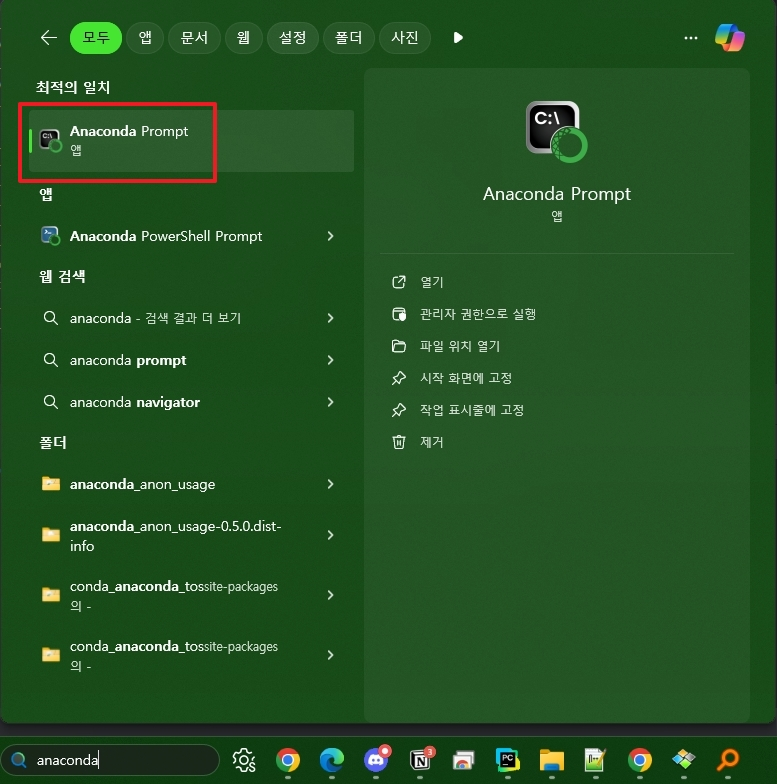
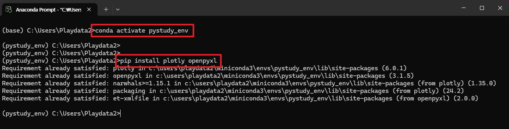
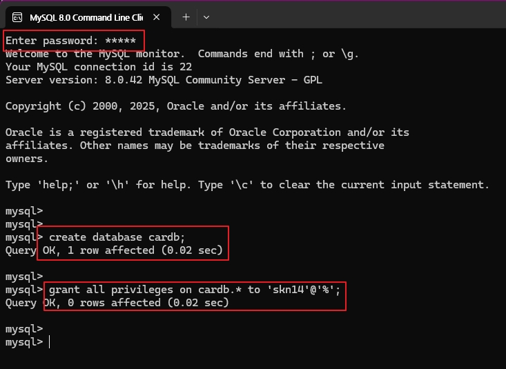
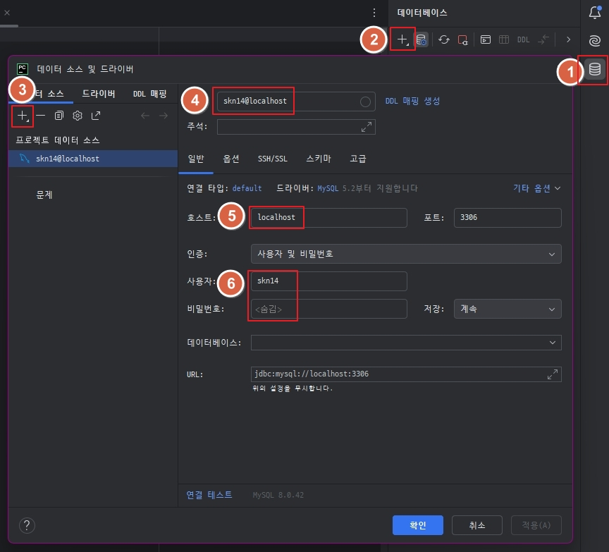
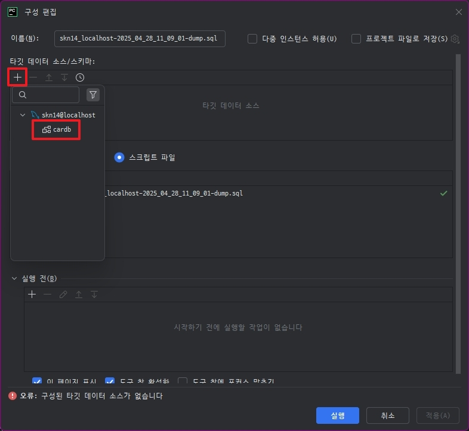
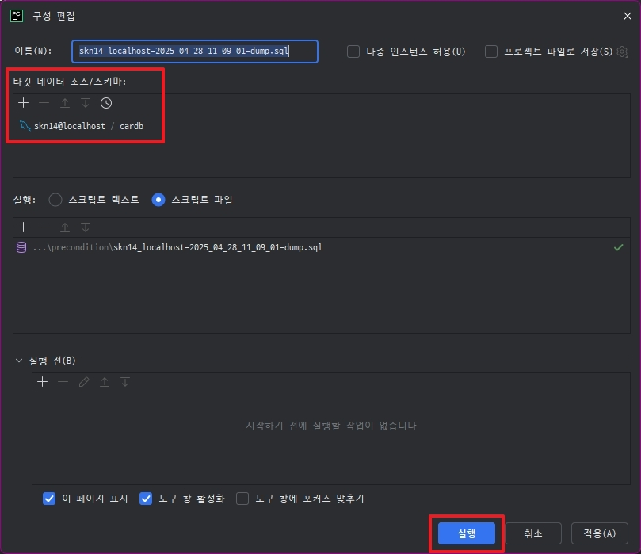
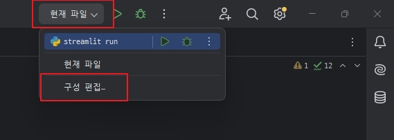
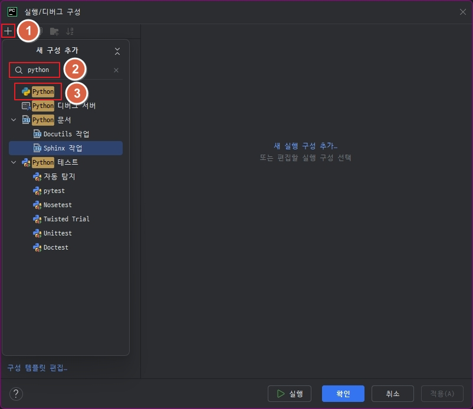
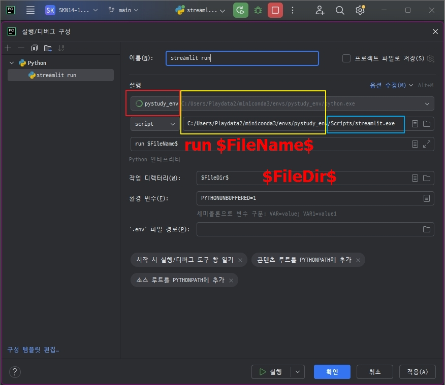

# 프로젝트 진행 및 실행 전 선행작업

## 패키지 설치
- plotly
- openpyxl

1. anaconda 명령창을 열고, 필요한 패키지를 설치한다.
    ```commandline
        conda activate pystudy_env
        pip install plotly openpyxl
    ```
    
    


## Table 생성
1. MySQL 에 `root` 계정으로 접속해서 신규 스키마 `cardb` 생성하고,<br/>
    `skn14` 계정에서 `cardb` 스키마에 대한 모든 권한 부여<br/>
    <br/>
    ```sql
      ;############################################
      ;# 여기부터는 root 계정으로 수행해야 함.
      ;############################################
      create database cardb;
      grant all PRIVILEGES on cardb.* to 'skn14'@'%';
    ```
2. 각 작업자 PC 에 설치된 MySQL에 대한 접속정보 설정<br/>
    
3. skn14_localhost-2025_04_28_11_09_01-dump.sql 덤프 실행<br/>
    <br/>
    <br/>
    <br/><br/>


## PyCharm 에 streamlit 실행/디버그 구성하기
1. PyCharm 에서 구성 편집 메뉴를 연다.<br/>
    <br/><br/>
2. python 구성을 추가한다.<br/>
    <br/><br/>
3. `실행` 에는 python 을 실행할 환경과<br/>
    streamlit 실행파일의 경로,<br/>
    streamlit 이 수행할 명령어와 현재 작업중인 파일명 변수를 입력하고,<br/>
    `작업 디렉터리`에는 `$FileDir$` 를 넣고 저장한다.<br/>
    <br/>
    ```commandline
		    ; streamlit 이 설치된 경로 확인
		    C:/Users/Playdata2/miniconda3/envs/pystudy_env/Scripts/streamlit.exe

		    run $FileName$

		    $FileDir$
    ```